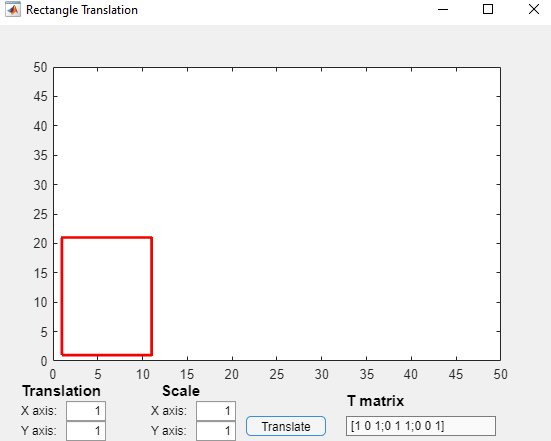

### Geometric transformation Assignment

A matlab gui that shows geometric transformations in two dimension. Transformations include translate and scale. 

### How it works
Whenever translate button pressed, program takes translate and scale values in input boxes. Calculates new coordinats of shape and set.

Calculation steps of new coordinats example of translation process;
- Take x and y axis translation values
- Update **T  translation matrix**
- Convert two dimension coordinats to homogen coordinats (P) such as [x;y] to [x;y;1]
- Matrix product of T matrix and homogen coordinats gives new coordinats (P).
**Mathematical representation -> P = T * P**